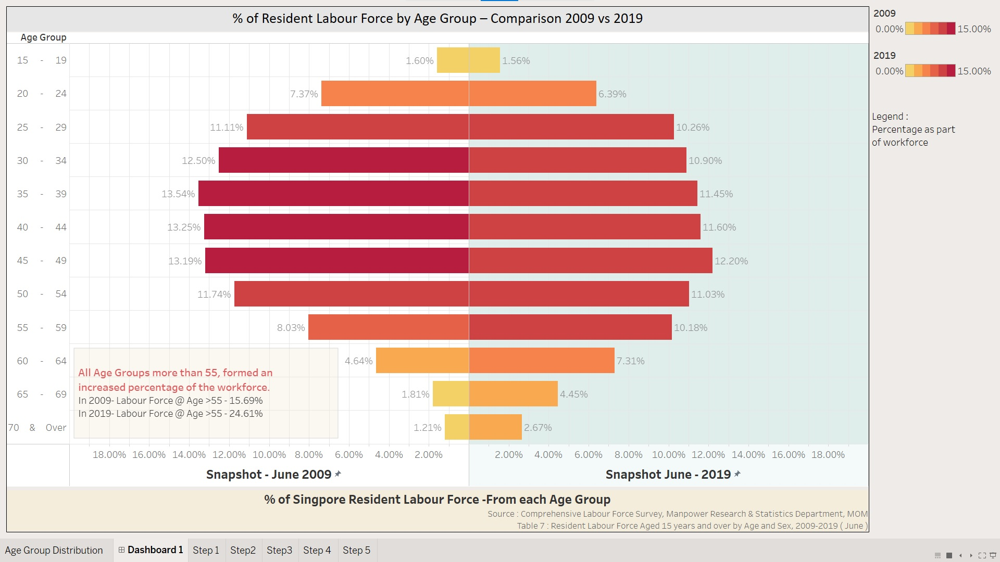

```{r setup, include=FALSE}
knitr::opts_chunk$set(echo = FALSE)
```

### 1. Link to Visualisation (Tableau)

<https://public.tableau.com/profile/evelynphanghuiwen#!/vizhome/DataViz1_16117030016390/AgeGroupDistribution?publish=yes>

### 2. Original Visualisation: 
![Original]

### 3a.Critic the Graph for Clarity and Aesthetics. 
### 3b. Suggestions for Improvement


### 3c. Using Tableau, design the proposed data visualization


###  3d. Provide step-by-step description on how the data visualization was prepared


####  3d.1 Data Exploration

Data Exploration – identifying the correct data source for the objective

Tableau is effective when using data that is structured. Each row is an item of data, and each column is an attribute. 

Objective: To achieve the purpose to show composition of different residents age-group – as part of total resident workforce.

Reviewing relevant table: Based on the diagram and looking in the report, if was realised that the data used for the chart is actually a calculated field from the data columns in Table 7 instead of Table 5 in the assignment reference.

Download Table 7 from the report, and delete the extra tabs for Male and Female as this into used in the analysis.

MOM Data Table 7 :https://stats.mom.gov.sg/Pages/Labour-Force-Tables2019.aspx


####  3d.2 Create the new data required from the existing worksheet.

Evaluate the Table 7 to find out how to compute the % contribution to the workforce for that age group.


1)Add a new worksheet ‘calculated’ - that computes the % contribution to the workforce for each group, using the data from T7_T tab in the excel. 

2)Each of the field above is computed based on the relevant fields 
Eg. For 2009, the Age Group contribution for 15-19 is 
[Age-Group[15-19]-workforce-for-the-year]/[Total-workforce-for-the-year]=  31.8/1985.7 = 1.6%. 

3)The “calculated” provides the required data for the chart: ( leveraging Excel or Tableau Prep).


####  3d.3 Implement a Bar Chart Visualisation for the calculated Sheet


For the 2009 chart, change the x-axis to have a reversed scale.


####  3d.4 Update the Marks of the colour 2009/2019 % -using the gradient color selection

* Use the 2009 and 2019 data, input to the ‘colours’ tab for both columns – 2009 and 2019.
* For both the colour ranges for 2009/2019, configure the 
i)6 color steps
ii)select  color gradient Red-Gold
iii)Configure the same Start and End ( 0, 15 ).


#### 3d.5 Adding and Fine Tuning Labelling, Captions,Font,Font Size


####  3d.6 Dashboard and Annotation to help the users capture the information



Create a Dashboard – and add an annotation for the key observation that the % contribution for Age Group to the workforce, has increased for Age Group >50 years old. To make the years clearer, add a pane background to show the distinction between Year 2009 and Year 2019.


## 4. Final DataViz and Top Three insights from DataViz

Main Objective: My DataViz wants to communicate the composition of workforce base on age-group % of the workforce showing the change over the 10 years from 2009 to 2019 as the key objective. 
(Other info such as male vs female, change in absolute size of workforce is also interesting but is not addressed within this assignment).

*1st Insight :* 
Between 2009 and 2019, the distribution of % of workforce remained largely the same with the age groups 35-49 contributing the largest percentages. [ Judging from the three longest bars of the chart for both June 2009 and June 2019].


*2nd Insight:*
There is a significant increase in the percentage contributed by the age group from 55 and beyond.  [ Judging from clearly longer bars, and significant change in color on the right side of the chart ].


*3rd Insight:*
The is a slight decrease in the percentage of increase contributed by the age group from 55 and below.  [ Judging from clearly longer bars, and significant change in colour on the right side of the chart ].


