```{r setup, include=FALSE}
knitr::opts_chunk$set(echo = FALSE)
```

### 1. Link to Visualisation (Tableau)

https://public.tableau.com/profile/evelynphanghuiwen#!/vizhome/DataViz2EvelynPhang_16136603094040/DivergentVAC1?publish=yes

### 2. Original Visualisation: 
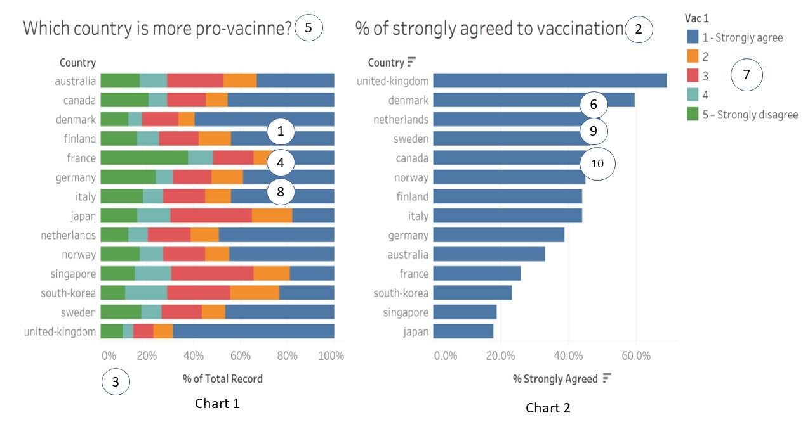

### 3a.Critic the Graph for Clarity and Aesthetics. 
### 3b. Suggestions for Improvement


### 3c.1 Sketch Out the Proposed Design 


**Chart 1 : Choice of Chart :Divergent Stack Bar**

This is the best choice for communicating survey results that was in in the form of a Likert scale [ (Likert 1932), which consists of a discrete number of choices per question among the sequence: “Strongly Disagree”, “Disagree”, “No Opinion”, “Agree”, “Strongly Agree”].In a Likert Scale that has 5 options, the positive responses will include the top 2 options – Strongly Agree and Agree.

*Additional Filter for Demographics:*
To allow the user to select view of this data based on certain social-demographics, we should implement a selectable filer ( Multiple Selection Dropdown List) for the user to select. 

**Chart 2: Attitudes in Vaccination : Divergent Stack Bar**

The data source provided additional survey questions, that provider deeper insights of possible reasons why people may accept or not accept the vaccine. I will leverage 4 of this survey from the same source : but from the survey tables vac2_1,2_2,2_3,2_6 – to create the Likert scale response in the form of a Divergent Stack Bar – that will also be used as a TOOLTIP of Chart 1.
Same Filters must apply for demographics ( also when presented in the Tooltip ).


**Chart 3 : Agree/Strongly Agree – Bar Chart**

I will implement a bar chart for  the two Scores – Agree/StronglyAgree instead of just a bar chart for “Strongly Agree”. In a Likert Scale survey, the top 2 choices are both as indicative of positive choices.

**Chart 4 :   Agree/Strongly Agree – Error Bar/Confidence Bar – to address uncertainty**

This chart is used to illustrate the fact that depending on the quality of the samples and the number of samples taken, the data presented by the charts – may not have a high confidence of certainty. To illustrate this, I will plot the Agree/Strongly Agree – confidence scores for both 95% and 99% in the same chart to illustrate the part.

### 3c.2 Using Tableau, design the proposed data visualization


###  3d. Provide step-by-step description on how the data visualization was prepared

####  3d.1 Data Exploration and Data Cleansing

Data Exploration – identifying the correct data source for the objective.Tableau is effective when using data that is structured. Each row is an item of data, and each column is an attribute. For the purpose of this assignment, I stick with the 15 countries analysed in the original visualiation:Australia,Canada,Denmark,Finland,France,Germany,Italy,Japan,Netherlands,Norway,Singapore,South-Korea,Sweden,United Kingdom.

**Data Prep Step 1 :**

Import the data and create the new data required from the existing country worksheets.

Create a new Union – of all the excel of the 15 countries. Except for the columns in the right panel, hide all other columns


Export the filtered columns into a new excel AllCountries00.xls and start a new Tableau Project.


**Data Prep Step 2 :Import the file from the previous steps and continue data prep.**

1)TableName – split this attribute, to create a new column that is renamed <Country> . The reason for doing this is to extract just the word <country> from the table name <country>.xls

2)Rename some attributes
Rename the attribute Household Size  to “Size of Household”
Rename the attribute “Household Children” to “Children in household”

3)Create numerical version of the survey response using this logic. Apply this to all survey response, VAC_1, VAC_2, VAC_3, VAC2_1, VAC2_2, VAC2_3, VAC_


Do this to create new numeric fields from the original character fields:
VAC_1_num, VAC_2_num, VAC_3_num, VAC2_1_num, VAC2_2_num, VAC2_3_num, VAC_6_num.
4)Hide the original string based VAC data.
VAC_1, VAC_2, VAC_3, VAC2_1, VAC2_2, VAC2_3, VAC_6.
5)Pivot on the new fields: VAC_1_num, VAC_2_num, VAC_3_num, VAC2_1_num, VAC2_2_num, VAC2_3_num, VAC_6_num.

**Data Prep Step 3 : Select all VAC columns for pivot**


Rename the Pivoted columns as : “Survey” and “Score”, and change the data type for score to ‘integer whole’.

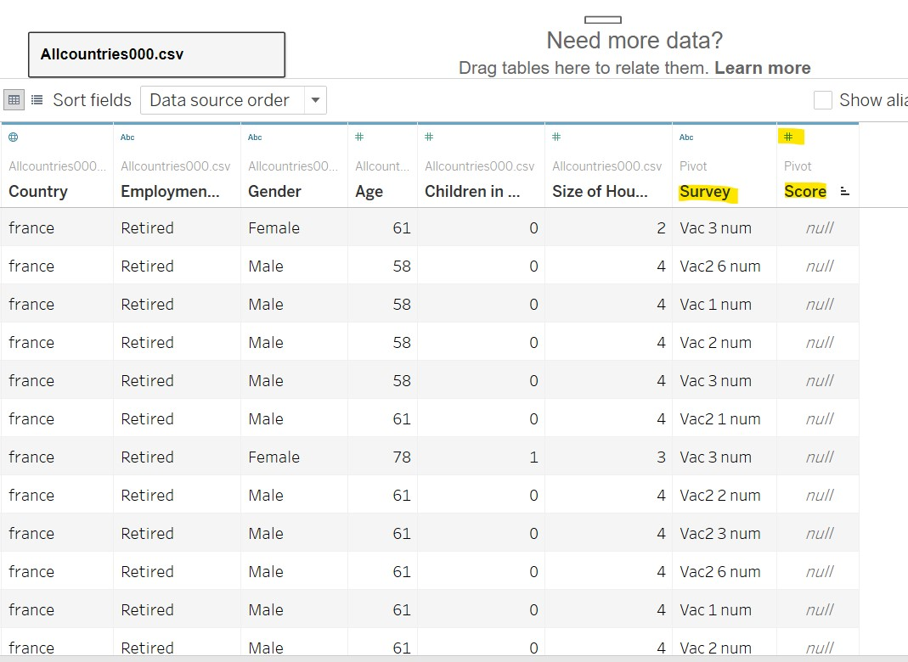
**Data Prep Step 4 : Build the needed Calculated Fields**


**Data Prep Step 5 : Create Some Meaningful Aliases**

For all the scores create the value alias
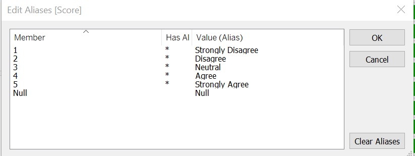

For the sub-surveys create the survey alias
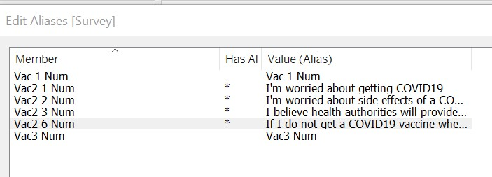
For the countries , as these are names ( proper nouns) , create alias with the Country names – starting with capital letters.

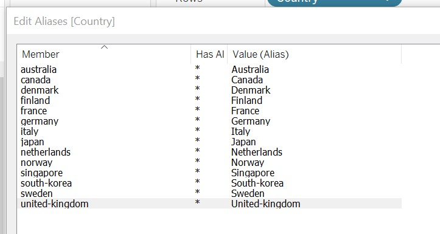

### 3d.2 Building the required Charts

**Building Chart 1 : Survey output of VAC1_Num **

Key Steps :

1)Adding Gantt Percent to the Columns – select compute using score
2)Adding ‘Countries’ to the Row – select sort by ‘Count Agree’
3)Add Survey to the Filter (Edit Filter- and select VAC1num)
4)Add Score to the Filter (Edit Filter- Select all except Null )
5)Add Gender to the Filter (Edit Filter - Select ‘Male’ and ‘Female’ )
6) Add Size of Household to the Filter– select all
8) Add Children of Household to the Filter– select all
9) Add Employment Status to the Filter– select all
10) Add Age to the Filter – ensure that it is a ‘continuous’ dimension.
11) In Marks – select “Gantt Bar”


12)Format the X-axis – Scale- Numbers : Percentage with 0 decimal space

13)Configure the colours of the Divergent Chart – using two shades of the same colour for positives (Strongly Agree,Agree ) and two shades of the another colour for negatives ( Strongly Disagree, Disagree ) and lighter colour for neutral.

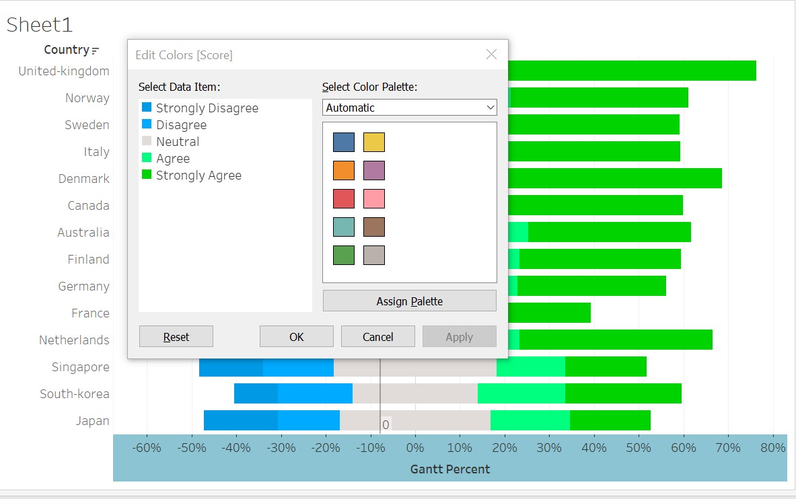
13)Add a reference line at 0% for the X-axis, Value =0 and Constant, with Label=Custom, 0%


14)Configure all Filters to “Show Filter”.As they showup on the right panel , configure them as “Multiple Value” Dropdown, except for the AGE filter, which is a continuous range slider.

15)Implement formatting to the chart:

a)	Select on the Menu bar, Format, Workbooktheme, Modern
b)	Select on the Menu bar, Format, Lines, Gridlines, select to middle grey.
c)	Change the title to : Respond to Survey Question : " If a Covid-19 vaccine were made available to me this week, I would definitely get it"


16)Turn on animation.

 

17)Rename the first chart as “Divergent VAC1”.

**Building Chart 2 : Attitudes of Vaccination **

Key Steps;

1)Implement a new chart called “Attitudes of Vaccination” -using the data from the survey question VAC2_1,VAC2_2,VAC2_3,VAC2_6. To do this, first duplicate the first chart "Divergent VAC1". For this second chart rename it “All attitudes”.

2)Based on the duplicated and renamed chart,
-Move the “Country” pill back into the shelf.
-Move the “Survey” pill from the shelf into row

3)Edit the Filter for the ‘Survey’ pill in the Filter Shelf to show only the four – sub attitudes. 
5)Rename the title of this second chart to : Attitudes Towards Vaccination by All

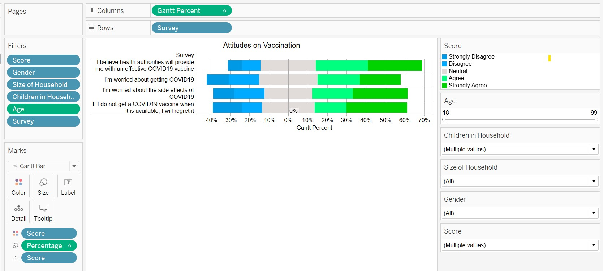
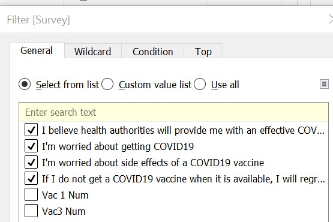

**Updating Chart 1 : Adding the Tooltip **

18)Go back to the First Chart, and implement the following Tooltip.


The resulting outcome is as follows :

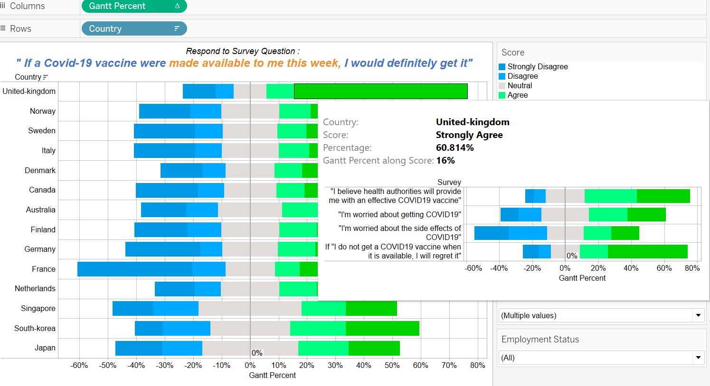

**Building Chart 3 : Agree/StronglyAgree Error/Confidence Bars **

Duplicate the Sheet “Divergent VAC1”. Rename the new sheet as “Agree/Strongly Agree Error Bars”. 


Step 1 : Implement the following new ‘Calculated’ fields to achieve the Error bar chart.

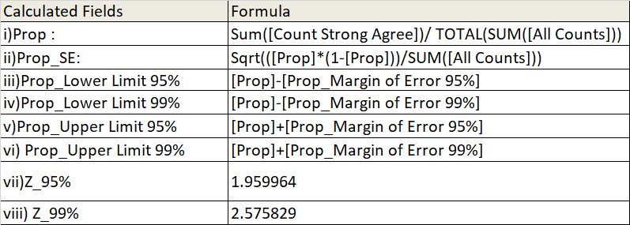

Step 2 : Repopulate the “Columns” with Measure Values, and then Prop 
In the “Filter” Shelf, Edit the Filter for Measure Values to show only :
Prop_Lower Limit 95%
Prop_Upper Limit 95%
Prop_Lower Limit 99%
Prop_Upper Limit 99%

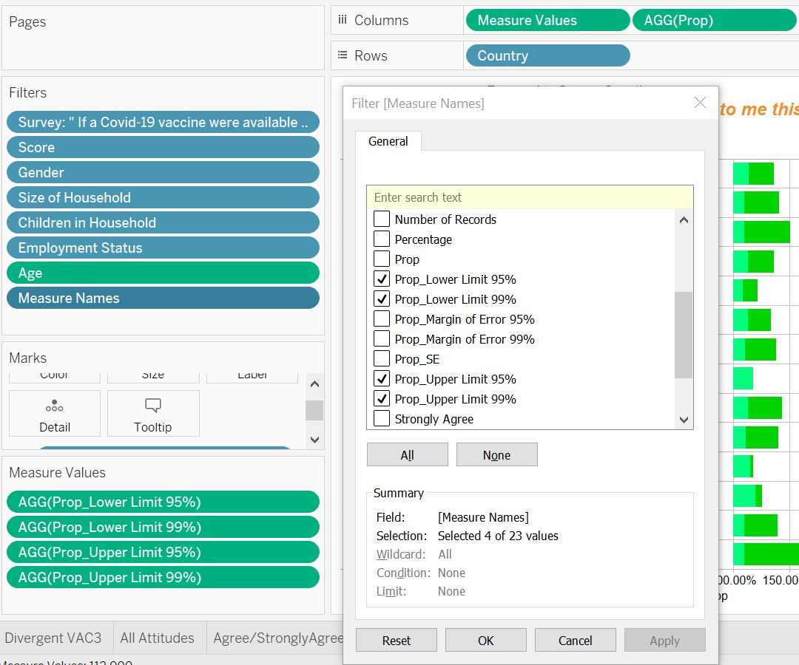

Step 3 : In the MARKS card, for “Measure Values” , select type “Line” and add Measure Values into ‘Colour’,’Size’,’Path’,’Detail’

Step 4 : In the MARKS card, configure “AGG(PROP)” to be type “Circle” and add ‘Measure Names’ into detail, and (CNT)Number of Records into the Tooltip


Step 5 : Updating the MARKS Card

In the MARKS card, for “Measure Values”, configure “Tooltip” as follows :
Country: <Country>
<Measure Names>: <Measure Values>

In the MARKS card, for “AGG(PROP)”, configure “Tooltip” as follows :
Measure Names: <Measure Names>
Country: <Country>
Prop: <AGG(Prop)>
Number of Records : <CNT(Number of Records)>

Adjust the Colours as follows in the “MARK” tray and set Opacity to “50%”.
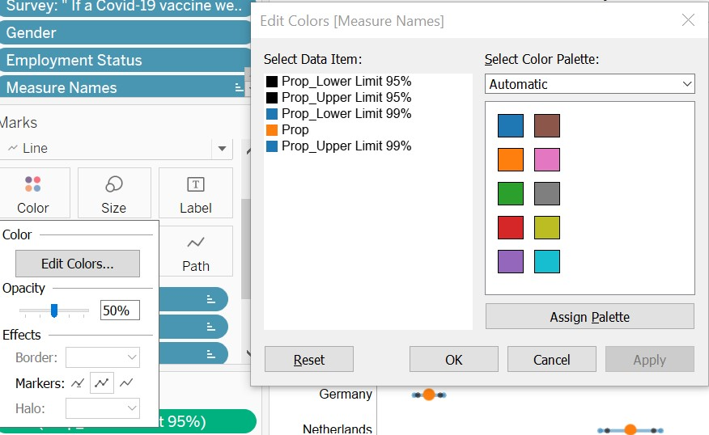

Step 6 : Drop the ‘PROP’ from column, into the chart again as a second X-Axis “at the top”. Synchronize the Axis.


Step 7 : Configure the right panel to show only the Filters for : “Survey” and “MeasureValues” so that we can configure which survey the chart is displaying, and also Confidence upper bound and lower bounds we want to view. 


Rename the title of this chart – shows that it ‘dynamically’ reflects the results for the appropriate survey.

Step 8 : Rename the title of this chart – shows that it ‘dynamically’ reflects the results for the appropriate survey.

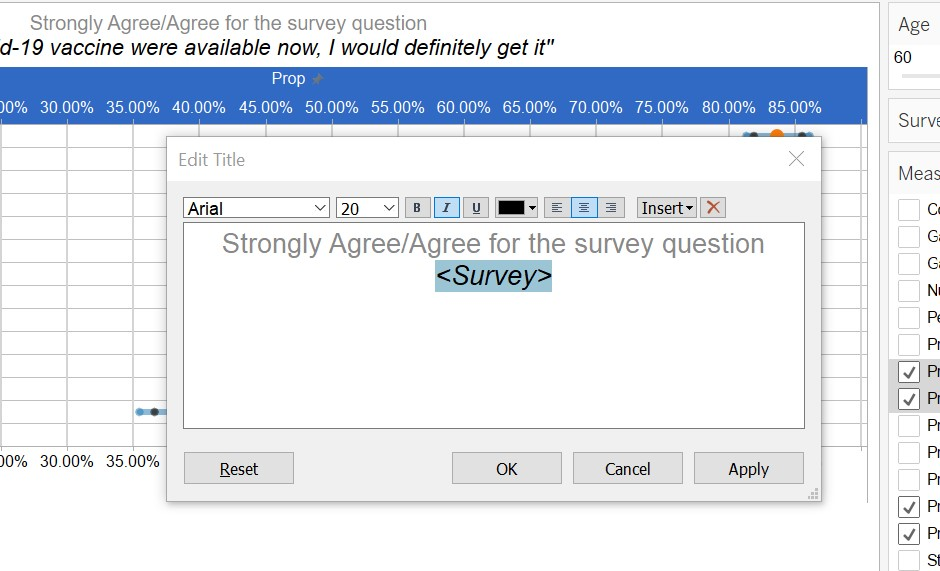
**Building Chart 5 : Agree/StronglyAgree Error/Confidence Bars **

Duplicate the “Divergent VAC1” sheet , and rename it as Agree/Strongly Agree Bar Chart.

Remove everything in Column and populate with “Strongly Agree” Measure Value, Format this as “Percentage” with 2 decimal places.
Remove everything in Row and populate with “Country”.
In Marks, remove everything, and then Add “Score” into colour.
In Marks, change the chart type to “Bar”.

Implement the following tool tip:


Result implementation is as below:


Rename the title of this chart – shows that it ‘dynamically’ reflects the results for the appropriate survey.
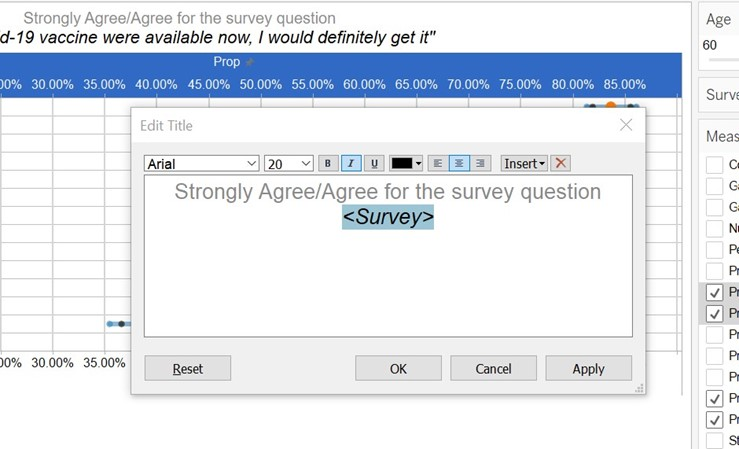

As a last step, add the source references to all Charts. 
Source : Imperial College London YouGov Covid 19 Behaviour Tracker Data Hub https://github.com/YouGov-Data/covid-19-tracker


## 4. Final DataViz and Top Three insights from DataViz

**4.1 Main Objective**

My DataViz wants to communicate the attitudes towards taking Covid19 vaccination- based on the ( Source : Source : Imperial College London YouGov Covid 19 Behaviour Tracker Data Hub ) to highlight
1)	Differences in attitudes between Countries
2)	Differences in attitudes between now and 1 year from now
3)	Highlight how the data source is reliable or show the confidence level of the data

**4.2 Final DataViz**

Chart 1 : Divergent Bar Chart of Survey Response : Getting the Vaccine Available Now

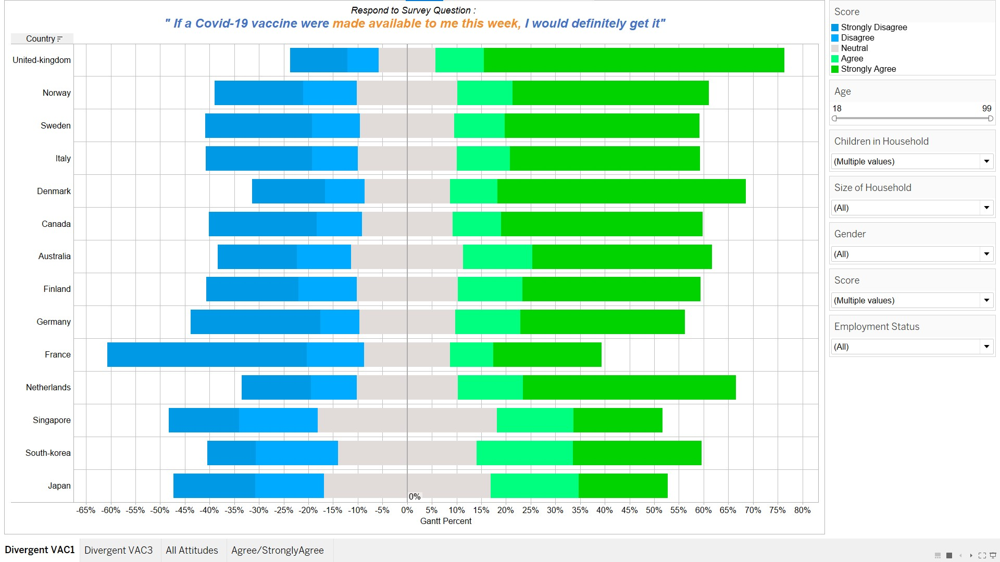
Chart 2 Divergent Bar Chart of Survey Response : Getting the Vaccine Available Now with Tool Tip


Chart 3:  Divergent Bar Chart of Survey Response : Getting the Vaccine Available One Year from Now with Tool Tip

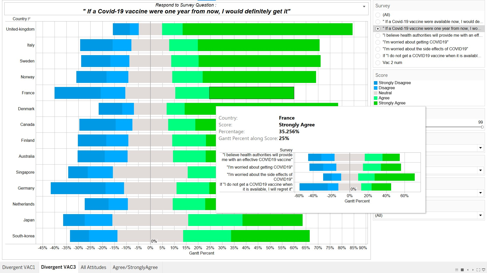
Chart 4 : Divergent Bart Chart on Attitudes on Vaccination 


Chart 5: Agree/Strongly Agree – Error Bars - 95%/99% confidence

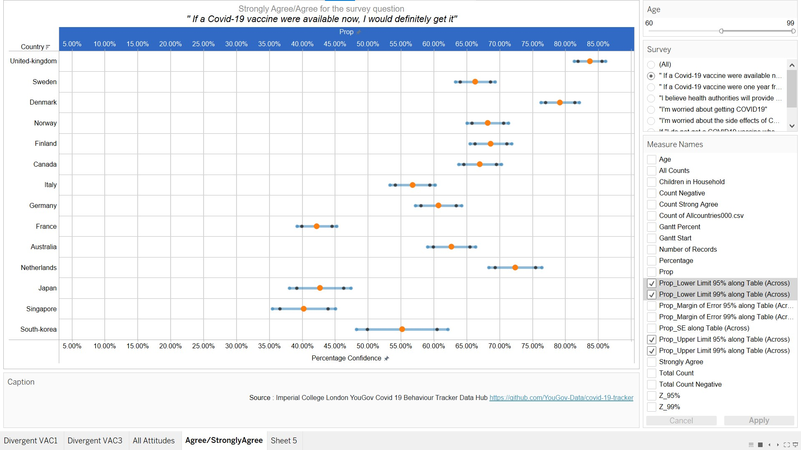
Chart 6: Agree/Strongly Agree – Bar Charts


**4.3 Key Insights**

**1st Insight :Asian Countries were in general less receptive to the vaccine and attitudes about taking the vaccine one year from today did not change much**


UK has the highest number of people who are willing to take the vaccination as soon as possible, and in deeper dive we can see that they have strong confident in the health authorities( > 60%), and at the same time low fear of side effects ( < 50% ). All the Asian countries had low willingness to take the vaccination. When I further compared this with the attitude one year from now, there was no significant change in willingness to accept the vaccine.

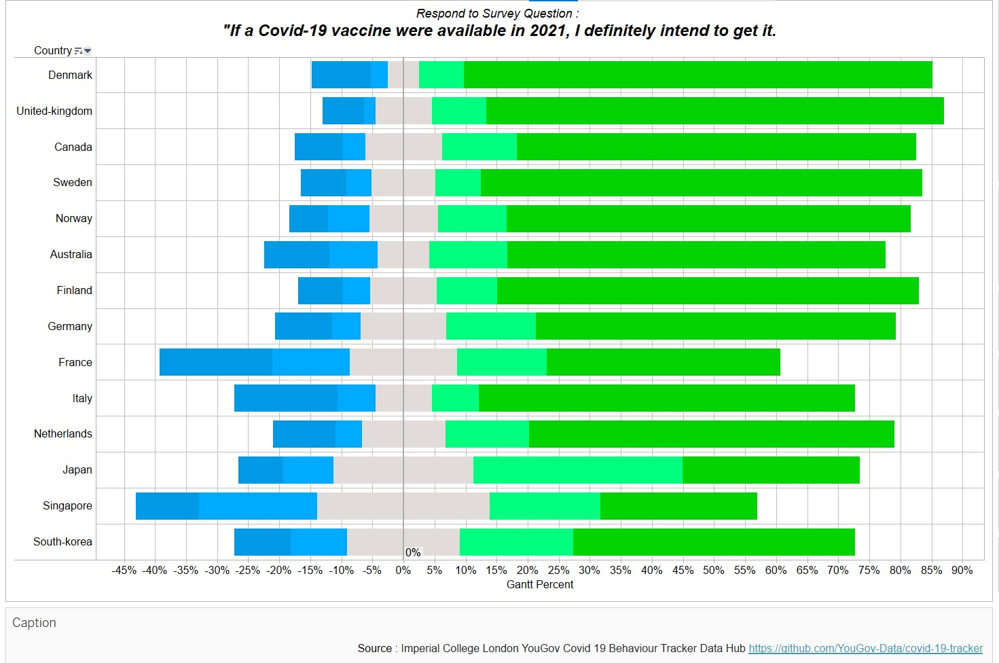

THe opinion about willingness to accept the Vaccine did not change significantly if it was offered to be available one year later instead of in 1 week's time.


**2nd Insight:People's Willingness to accept vaccine, can be explained by their fear/worry about the Vaccine/Covid-19**

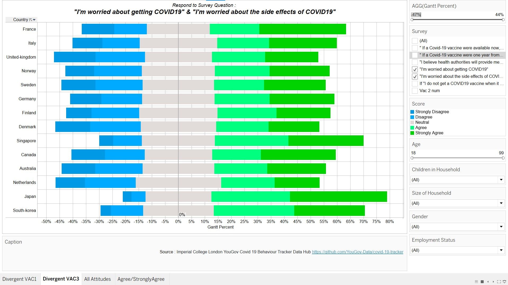

The countries that were most worried about the side effects of the vaccine, and are worried about getting Covid19- are the two North Asia Countries Japan and South Korea. Not surprisingly people in the UK and Denmark are the least worried, and are thus also in the top 5 countries most willing to accept the vaccine.


**3rd Insight:From the same data sources,data from different ranges may have different certainty/confidence **

As the oldest people are the most vulnerable, it is important for most governments that they are vaccinated first. Based on Chart 1, across all countries, for the age group from 70 and beyond, compared to the general population a significant percentage of people who are prepared to accept the vaccine. 


From the chart above, across all countries – Top 5 countries have positive responses in the range of 50% to 70%- when considering participants from all age group


From the next chart above, across all countries – Top 5 countries have positive responses in the range of 70% to 85% when considering participants from age group between 70 to 99.


But….is this really the truth ?

By looking at the Error Bar/Confidence chat, we discover that the confidence interval for this ‘older age group range’ is actually much lower compared to the original data. Take for eg Singapore at 95% confidence, the percentage of people who indicated agree/strongly-agree ranged from 26% to 44% - for those in the age group 70 to 99 compared to 32% to 35% if considering all ages. See the two charts below.

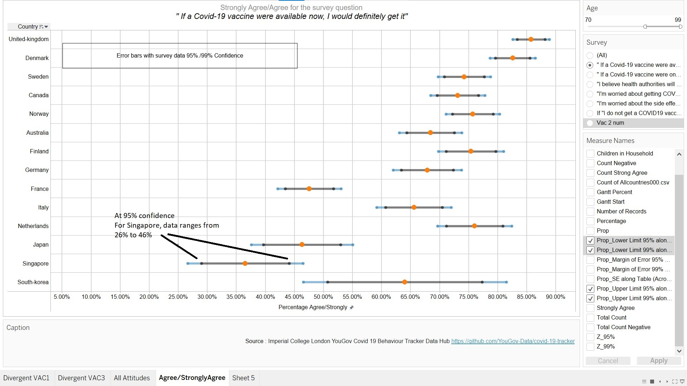
