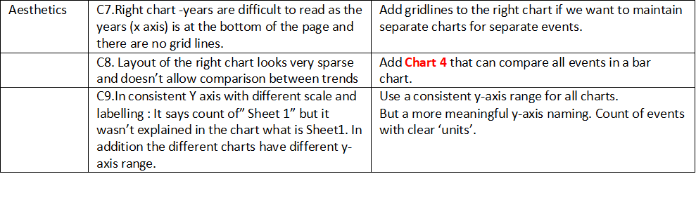
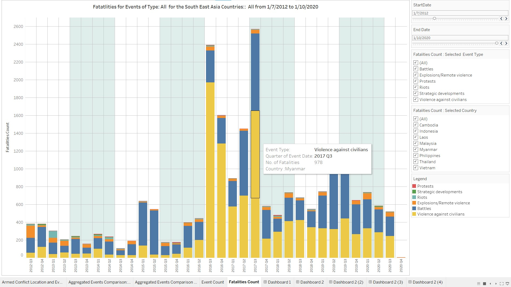
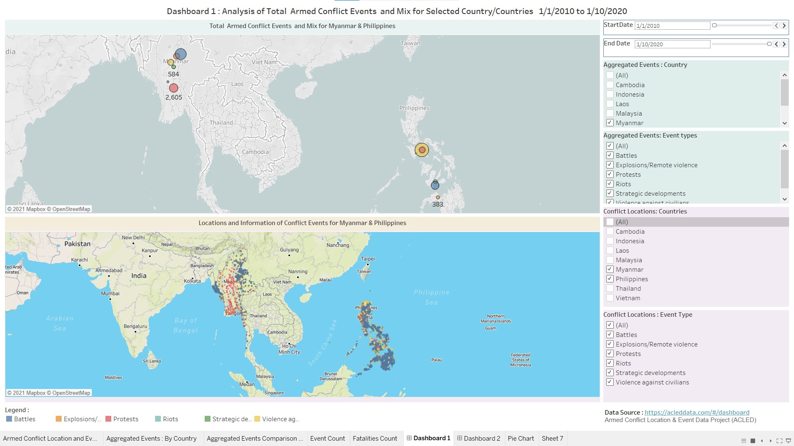
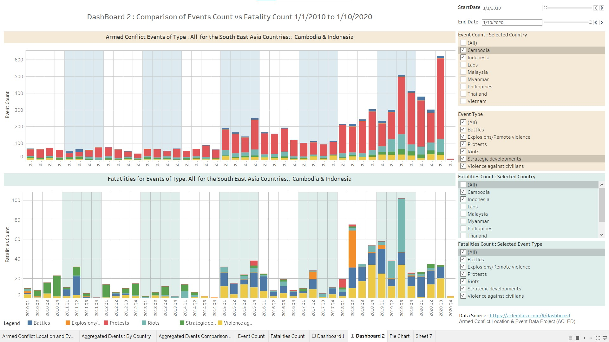

```{r setup, include=FALSE ,fig.height= 2}
knitr::opts_chunk$set(echo = FALSE)

```

### 1. Link to Visualisation (Tableau)

https://public.tableau.com/profile/evelynphanghuiwen#!/vizhome/EvelynPhangMITB_DataViz3/ArmedConflictLocationandEvents

### 2. Original Visualisation: 


### 3. Critique

### 3.1 Critic the Graph for Clarity and Suggestions for Improvement


### 3.2 Critic for Aesthetics and Suggestions for Improvement



### 4. Proposed Design Sketch

This a very initial paper design sketch - of the proposed 5 visualisations.


### 5. Final Visualisation

Final DataViz ( I suggest that this 5 visualizations can unveil different insights).


  


  

  


  
 
  


## 6. Top 3 Insights

### First Insight : 
Based on chart ‘Location of conflict events’. It can be observed Philippines has a variety of events across the all islands, and also in eastern Thailand. Whereas in other parts of South East Asis eg. events are more spreadout, or occurring only in certain parts of the country eg. In Indonesia only in Central Java.


### Second Insight:

Based on the table ‘No of Conflict events – comparisons between countries’ – Philippines has the most no. of “Violence against civilians” across the complete data collection period. Mynammar has the most no. of Battles, and Indonesia has the most no. of protests, across the data collection period from 2010 to 2020.


### ThirdInsight:

Evaluating the bar chart “Fatalities for Events” vs ‘Armed Confliect Events”= for the same period, we can see that  “Violence Against Civilians and Battles events caused the most fatalities. There was a sharp increase in both Events and Fatalities during the 5 quarters starting from 2016Q3. This is caused mainly by the events in Myanmar(for Battles) and Philippines ( for violence against civilians). On further filtering i discovered that data for Philippines was only available from 2016 - so that is also one of the reasons for the sudden jump.


## 7. Step by Step 

(Provide step-by-step description on how the data visualization was prepared)

### 7.1 Step by Step : Data preparation

7.1.1 Import the data : which is an excel

```{r, echo=FALSE, out.width="70%",fig.align='center'}

```

7.1.2 Create parameter Start Date and End Date, implement it as a slider with restricted range ( based on what we see is in the raw data ).
 
7.1.3 Create the Calculated Field Duration using the newly created parameters:

```{r, echo=FALSE, out.width="80%",fig.align='center'}
knitr::include_graphics("data3/Step3.jpg")
```

### 7.2 Step by Step Chart 1: Location of Conflict Events 

7.2.1 In Worksheet 1 of the Tableau work -Populate the following columns , rows, filters my dragging the parameters from the side bar into : Columns, Rows, Filters, Marks( use circle), Details ( see below ), Tool Tips.

```{r, echo=FALSE, out.width="70%",fig.align='center'}

```

The implementation : allow for Event Date,Notes,Fatalities,Country,Location to be part of informative tool tip.

7.2.2 Configure the filters to show filter: Country ,Event Type, Duration ( from the Filters Panel).
Configure the colours to show filter : Event Type ( from the Marks panel ).
For Duration, configure as slider. For Event Type/Country- configure as dropdown checkpoint list, multiple.Rename the title of the filters – so that they are linked back meaningfully to the chart.  Unhide the ‘Legend’ in the filter.

```{r, echo=FALSE, out.width="80%",fig.align='center'}

```

7.2.3 Rename the title to include the start and end dates parameters.


7.2.4 Implement a more complete tooltip with added fields such as 
Event Type,Date,City,Country,Fatalities,Notes


```{r, echo=FALSE, out.width="80%",fig.align='center'}

```

7.2.6 Completed Chart 1

```{r, echo=FALSE, out.width="120%",fig.align='center'}

```

7.2.7 Rename the Sheet 1 as :Armed Conflict Location and Events

### 7.3 Step by Step Chart 2: Aggregated Events : Per Country 

7.3.1 Populate the second tableau worksheet with the following columns , rows, filters my dragging the parameters from the side bar into : Columns, Rows, Filters, Marks( use circle), Details ( see below ), Tool Tips.

```{r, echo=FALSE, out.width="80%",fig.align='center'}
knitr::include_graphics("data3/chart2-1.jpg")
```


7.3.2 Formatting : ForColour,configure the markers to have opacity 60% and , border of black. For Size, configure the size of the Circle Marker.


7.3.3 For Count – ensure that use count at both Country and Event Type level. Configure : Count(Sheet1) as follows:

```{r, echo=FALSE, out.width="80%",fig.align='center'}
knitr::include_graphics("data3/chart2-3.jpg")
```

7.3.4 Configure the Filter Panel to have all the following filters to ‘Show Filter’ and also rename the titles something meaningful. Configure the Title to dynamically show the StartDate and EndDate.


7.3.5 Configure the Label to show the actual events count

7.3.6 Implement a pie-chart worksheet for the tooltip. This piechart allows the user to see for each country what is the percentage of event type, compared to the total events.

```{r, echo=FALSE, out.width="80%",fig.align='center'}
knitr::include_graphics("data3/chart2-10.jpg")
```

7.3.7 Implement the tooltip as follows

```{r, echo=FALSE, out.width="50%",fig.align='center'}
knitr::include_graphics("data3/chart2-11.jpg")
```
```{r, echo=FALSE, out.width="50%",fig.align='center'}
knitr::include_graphics("data3/chart2-12.jpg")
```

7.3.10 Rename the Sheet to Aggregated Events : By Country. THe Completed Final visualisation.


### 7.4 Step by Step : Chart 3 : Aggregated Events Comparison : Bar Chart

7.4.1 Populate the third tableau worksheet. Populate the following columns , rows, filters my dragging the parameters from the side bar into : Columns, Rows, Filters, Markers,Colours

```{r, echo=FALSE, out.width="70%",fig.align='center'}
knitr::include_graphics("data3/chart3-1.jpg")
```

7.4.2 Rename the secondary axis labelling for the y-axis to “Event Count” from “Count of Sheet1”.

```{r, echo=FALSE, out.width="70%",fig.align='center'}
knitr::include_graphics("data3/chart3-2.jpg")
```
7.4.3 Format the Chart. Configure Grid lines – from the top bar, select ‘Format’, ‘Gridlines’, Subtab Rows-select mid grey.Repate for Sub-tab Column.

```{r, echo=FALSE, out.width="70%",fig.align='center'}
knitr::include_graphics("data3/chart3-3.jpg")
```
7.4.4 Format the Chart. Format the panel column in the chart so that all the quarters of the same year, have the ‘same colour’ by choosing a shading colour and adjust the “band size” to the right level.

```{r, echo=FALSE, out.width="70%",fig.align='center'}

```

7.4.5 Turn on the mark label – so that the counts can be seen immediately.

```{r, echo=FALSE, out.width="70%",fig.align='center'}

```

7.4.6 Format the tooltip as follows:

```{r, echo=FALSE, out.width="70%",fig.align='center'}

```

7.4.7 Edit the title to dynamically reflect the startdate and enddate parameters

```{r, echo=FALSE, out.width="70%",fig.align='center'}
knitr::include_graphics("data3/chart3-7.jpg")
```
7.4.6 Completed Visualisation as follows:


### 7,5 Step by Step : Chart 4 : Trends of Events– over time

7.5.1 Populate the third tableau worksheet with the following columns ( Event Type ), rows (CNT(Sheet1), filters by dragging the parameters from the side bar into : Columns, Rows, Filters, Markers,Tooltips.

```{r, echo=FALSE, out.width="70%",fig.align='center'}
knitr::include_graphics("data3/chart4-1.jpg")
```

7.5.2 Edit the “Table Calculation” for CNT(Sheet1) in Rows as follows with Compute using “cell”. 

```{r, echo=FALSE, out.width="70%",fig.align='center'}
knitr::include_graphics("data3/chart4-2.jpg")
```

7.5.3 Implement the following – Tooltip 


7.5.4 Format the Chart : Gridlines and Panel colouring so that all the quarters for the same year will have the same panel colour and some light grey row and column grid lines.

```{r, echo=FALSE, out.width="50%",fig.align='center'}

```

7.5.5 Format the title to include dynamic – start and end date as well as event types

```{r, echo=FALSE, out.width="50%",fig.align='center'}

```

7.5.6 Rename the y-axis to “Event Count”.

```{r, echo=FALSE, out.width="70%",fig.align='center'}

```
7.5.7 Configure the filter panel to turn on the filters for Event Type, Country, and the Legend, as well as the StartDate and EndDate – calculated field. Rename the filter appropriately.

```{r, echo=FALSE, out.width="60%",fig.align='center'}

```
7.5.8 Rename the worksheet as Event Count. Final Visualisation as follows.


### 7.6 Step by Step : Chart 5 : Trends of Fatalities– over time

7.6.1 Populate the fifth tableau worksheet with the following columns filters by dragging the parameters from the side bar into : Columns, Rows, Filters, Markers,Tooltips.

```{r, echo=FALSE, out.width="70%",fig.align='center'}
knitr::include_graphics("data3/chart5-1.jpg")
```

7.6.2 Configure the Sum(Fatalities) count as follows

```{r, echo=FALSE, out.width="70%",fig.align='center'}
knitr::include_graphics("data3/chart5-2.jpg")
```
7.6.4 Implement the tooltip as follows


7.6.5 Configure the readability of the chart – by adding gridlines ( light grey) for both rows and columns. And adding colour the panel to have all quarters in the same year as same colour.

```{r, echo=FALSE, out.width="50%" ,fig.align='center'}

```

7.6.6 Customised the Title of the chart to dynamically reflect the Event type, and also the Countries and StartDate/EndDate from the filters.


7.6.7 Format the Y-axis of the chart with title “Fatalities Count”

```{r, echo=FALSE, out.width="50%",fig.align='center'}
knitr::include_graphics("data3/Chart5-6.jpg")
```

7.6.8 Configure the Filter Panel to include the filters for Country, Event type, StartDate, EndDate and Legend. Edit the filter “title” and legend title accordingly. 

```{r, echo=FALSE, out.width="50%",fig.align='center'}
knitr::include_graphics("data3/Chart5-7.jpg")
```

7.6.9 Rename the chart as “Fatalities Count”. Final Visualisation as follows.


### 7.7 Adding the source of Information

Add the source of data to both dashboards in the righhand bottom footer. Here I show just one example.


