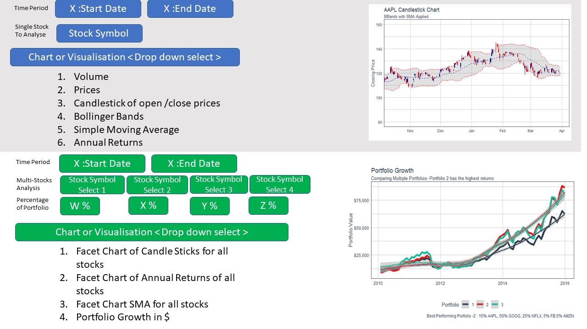

```{r setup, include=FALSE}
knitr::opts_chunk$set(echo = FALSE)
```

### 1.Background

Many investors analyze stocks based on their fundamentals such as their revenue, valuation, or industry trends but fundamental factors aren't always reflected in the market     price.  **Technical analysis** using charts help to identify trading signals and price patterns, and provides as a window into market psychology to identify opportunities to     profit.

My Project group we would like to product a SHINY APP - that provides various tools for a beginner investor,to analyse stocks past performance and forecasting.   

The final project has 3 parts:  
1)Forecasting ( leveraging **ModelTime** package)   
2)Visualisations for Stock Performance ( leveraging **TidyQuant** Package)  
3)Extensive Time Series analysis ( leveraging **TimeTK**)  

I will be covering part 2).

### 2. Objective/Layout of this assignment

This assignment explores the features of TidyQuant to experiment what is  best of the user, and also to identify any gaps that an eventually Shiny App implementation can adderss to improve the user's experience.


After some research,the following 3 charts provide the most information for the beginner trader to study a **single stock**:

* 1) Price Movement - Candlesticks Chart 
  + This chart reflect the impact of investor sentiment on security prices and are used by technical analysts to determine when to enter and exit trades. 

* 2) Stock Price and Trading Volume - Line Charts/Bart Charts
  + This chart provide the the volumes have been in the past and what they are currently before making a decision.

* 3) Moving averages (15-day, 50-day and 200-day) on a particular stock price movement- 
  + This chart provides information about the moving average. For Liquid/Volatile stocks may benefit from shorter (eg.15-day) moving average analysis where as illiquid stocks my be examined with 50-day moving average.


After some research, the typical two charts that is useful for a trader to analysis of **group of stocks** or **portfolio** :

* 1)Closing prices

* 2)Moving Average

* 3)Bollinger Bands

* 4)Annual Returns


### 3. Literature Review - Why TidyQuant (Tidy Quantitative Financial Analysis)


```{r}
# Loads tidyquant, lubridate, xts, quantmod, TTR, and PerformanceAnalytics

packages <- c('tidyverse','tidyquant','lubridate','xts','quantmod','TTR','PerformanceAnalytics')

for (p in packages){
  if (!require(p,character.only=T)){
    install.packages(p)
  }
  library(p, character.only=T)
}

```

TidyQuant addresses a few gaps that in the existing quantitative analysis functions (QAF).

GAP-1 :  Existing Quantitative analysis functions (QAF) -such as xts, zoo, quantmod, TTR, and PerformanceAnalytics work with time-series objects. These objects do not work well with the  data frames or the tidyverse workflow.

SOLUTION-1 : TidyQuant addresses this by providing a wrapper to enabling seamless usage within the tidyverse workflow.

GAP-2: Existing QAF functions for Stock Analysis do not provide any easy to use functions to load stock information and stock indices.

SOLUTION-2 : TidyQuant addresses this by implementing the following functions :Get a Stock Index, tq_index(), or a Stock Exchange, tq_exchange(): Returns the stock symbols and various attributes for every stock in an index or exchange. Eighteen indexes and three exchanges are available. To get Quantitative Data, tq_get()is implemented to provide a one-stop shop to get data from various web-sources.


GAP-3 : PerformanceAnalytics package consolidates functions to compute many of the most widely used performance metrics. 

SOLUTION -3 : Tidyquant integrates this functionality so it can be used at scale using the split, apply, combine framework within the tidyverse. Two primary functions integrate the performance analysis functionality:

- tq_performance implements the performance analysis functions in a tidy way, enabling scaling analysis using the split, apply, combine framework
- tq_portfolio provides a useful tool set for aggregating a group of individual asset returns into one or many portfolios.


#### 3.1 TidyQuant - Charting

The tidyquant package leverages ggplot2 - and has three primary geometry (geom) categories and one coordinate manipulation (coord) category that i will explore:

* ***Chart Types***: Two chart type visualizations are available using geom_barchart and geom_candlestick.

* ***Moving Averages***: Seven moving average visualizations are available using geom_ma.

* ***Bollinger Bands***: Bollinger bands can be visualized using geom_bbands. The BBand moving average can be one of the seven available in Moving Averages.

* ***Zooming in on Date Ranges***: 

  + Two coord functions are available (coord_x_date and coord_x_datetime), which prevent data loss when zooming in on specific regions of a chart. This is important when using     the moving average and Bollinger band geoms.


#### 3.2 TidyQuant - Portfolio Analysis

The ***Performance Analytics*** package in TidyQuant consolidates functions to compute the most widely used stock performance metrics. Tidquant integrates this functionality so it can be used at scale using the split, apply, combine framework within the tidyverse. 

* Two primary functions integrate the performance analysis functionality:

  + ***tq_performance*** - implements the performance analysis functions in a tidy way, enabling scaling analysis using the split, apply, combine framework.

  + ***tq_portfolio*** -  provides a useful tool set for aggregating a group of individual asset returns into one or many portfolios.
  

### 4. Loading and Preping Data : Single Stock and Multiple Stock analysis

Tidyquant provides a function tq_get for directly loading data. For the purpose of this assignment i use this funciton to get the data for APPLE, AMAZON, FACEBOOK< GOOGLE, NETFLIX. To preapre for a multi-stock analysis evaluation, i also built combined data set.

```{r}
AAPL <- tq_get("AAPL", get = "stock.prices", from = "2011-01-01", to = "2021-03-31")
AMZN <- tq_get("AMZN", get = "stock.prices", from = "2011-01-01", to = "2021-03-31")
GOOG <- tq_get("GOOG",get = "stock.prices", from = "2011-01-01", to = "2021-03-31")
NFLX <- tq_get("NFLX",get = "stock.prices", from = "2011-01-01", to = "2021-03-31")
FB <- tq_get("FB",get = "stock.prices", from = "2011-01-01", to = "2021-03-31")
```


```{r}
FAANG<- rbind(FB,AAPL,AMZN,NFLX,GOOG)
```

Setup the End Data for review as last day in March of 2021

```{r}
end <- as_date("2021-03-31")
```

### 5.Testing and Prototyping -  Single Stock Analysis ( Using APPLE stock)

#### 5.1  Candlestick Chart

#### 5.1.1 Candlestick Chart- Complete Period 


```{r}
AAPL %>%
    ggplot(aes(x = date, y = close)) +
    geom_candlestick(aes(open = open, high = high, low = low, close = close)) +
    labs(title = "AAPL Candlestick Chart", y = "Closing Price", x = "") +
    scale_color_tq(theme = "dark") +
    scale_y_continuous(labels = scales::dollar)
```
#### 5.1.2 Candlestick Chart- Zooming into a 6 week window.

```{r}
AAPL %>%
    ggplot(aes(x = date, y = close)) +
    geom_candlestick(aes(open = open, high = high, low = low, close = close)) +
    labs(title = "AAPL Candlestick Chart", 
         subtitle = "Zoomed in using coord_x_date- 6 weeks",
         y = "Closing Price", x = "") + 
    coord_x_date(xlim = c(end - weeks(6), end),
                 ylim = c(110, 140)) + 
    theme_tq() +
    scale_color_tq(theme = "dark") +
    scale_y_continuous(labels = scales::dollar)
```

#### 5.1.3 Candlestick Chart- Zooming into 1 week

```{r}
AAPL %>%
    ggplot(aes(x = date, y = close)) +
    geom_candlestick(aes(open = open, high = high, low = low, close = close)) +
    labs(title = "AAPL Candlestick Chart", 
         subtitle = "Zoomed in using coord_x_date - 14 days",
         y = "Closing Price", x = "") + 
    coord_x_date(xlim = c(end - weeks(1), end),
                 ylim = c(115, 130)) + 
    theme_tq() +
    scale_color_tq(theme = "dark") +
    scale_y_continuous(labels = scales::dollar)
```


#### 5.1.4  Candlestick Chart- Using different colours for the candlesticks.
 
The colors can be modified using colour_up and colour_down, which control the line color, and fill_up and fill_down, which control the rectangle fills.Using RED and GREEN - makes it very clear for the user.. which is the 'danger' candlestick.

```{r}
AAPL %>%
    ggplot(aes(x = date, y = close)) +
    geom_candlestick(aes(open = open, high = high, low = low, close = close),
                        colour_up = "darkgreen", colour_down = "darkred", 
                        fill_up  = "darkgreen", fill_down  = "darkred") +
    labs(title = "AAPL Candlestick Chart- 6 weeks ", 
         subtitle = "Zoomed in, Experimenting with Formatting: dark red and dark green gives the best visual",
         y = "Closing Price", x = "") + 
    coord_x_date(xlim = c(end - weeks(6), end),
                 ylim = c(110, 140)) + 
    theme_tq()
```

###  5.2 Stock Price and Trading Volume - Line Charts/Bart Charts

#### 5.2.1 Price Line Chart- for the full period

```{r}
AAPL %>%
    ggplot(aes(x = date, y = close)) +
    geom_line() +
    labs(title = "AAPL Line Chart- Prices", y = "Closing Price in USD", x = "") +
    theme_tq()
```
#### 5.2.2 Price Bar Chart- for the full period
```{r}
AAPL %>%
    ggplot(aes(x = date, y = close)) +
    geom_barchart(aes(open = open, high = high, low = low, close = close)) +
    labs(title = "AAPL Bar Chart -Stock Prices",
         subtitle = "The bar chart does not give move meaningful info then the line chart for large time scales",
         y = "Closing Price in USD", x = ")+
         ")+
    theme_tq()
```

#### 5.2.3 Price Bar Chart- for 6 weeks - zoomed in


```{r}
AAPL %>%
    ggplot(aes(x = date, y = close)) +
    geom_barchart(aes(open = open, high = high, low = low, close = close)) +
    labs(title = "AAPL Bar Chart of Stock Prices", 
         subtitle = "Zoomed in using coord_x_date- the y co-oordinate has to be hard-coded-this should resolved with interactivity",
         y = "Closing Price", x = "") + 
    coord_x_date(xlim = c(end - weeks(6), end),
                 ylim = c(100, 150)) + 
     theme_tq()
```


#### 5.2.4 Stock Volume Chart 

We can use the **geom_segment()** function to chart daily volume, which uses xy points for the beginning and end of the line. Using the aesthetic color argument, we color based on the value of volume to make these data stick out.


```{r}
AAPL %>%
    ggplot(aes(x = date, y = volume)) +
    geom_segment(aes(xend = date, yend = 0, color = volume)) + 
    geom_smooth(method = "loess", se = FALSE) +
    labs(title = "APPLE Volume Chart for the whole period", 
         subtitle = "Charting Daily Volume", 
         y = "Volume", x = "") +
    theme_tq() +
    theme(legend.position = "none") 
```

#### 5.2.5 Volume Chart - using Geom_segment- zoomed into past 50 days 

And, we can zoom in on a specific region. Using scale_color_gradient we can quickly visualize the high and low points, and using geom_smooth we can see the trend.

```{r}
start <- end - weeks(24)
AAPL %>%
    filter(date >= start - days(50)) %>%
    ggplot(aes(x = date, y = volume)) +
    geom_segment(aes(xend = date, yend = 0, color = volume)) +
    geom_smooth(method = "loess", se = FALSE) +
    labs(title = "APPLE STOCK Bar Chart", 
         subtitle = "Charting Daily Volume, Zooming In", 
         y = "Volume", x = "") + 
    coord_x_date(xlim = c(start, end)) +
    scale_color_gradient(low = "red", high = "darkblue") +
    theme_tq() + 
    theme(legend.position = "none")
```

#### 5.2.6 Moving Averages


Visualizing Trends averages is important for time-series analysis of stocks. Tidyquant includes geoms to enable “rapid prototyping” to quickly visualize signals using moving averages and Bollinger bands.


Within Tidyquant the following moving averages are available:
1)Simple moving averages (SMA)
2)Exponential moving averages (EMA)
3)Weighted moving averages (WMA)
4)Double exponential moving averages (DEMA)
5)Zero-lag exponential moving averages (ZLEMA)
6)Volume-weighted moving averages (VWMA) (also known as VWAP)
7)Elastic, volume-weighted moving averages (EVWMA) (also known as MVWAP)

For the purpose of this assignment i will look at SMA


#### 5.2.6.1 Charting the 14-day,50-day and 200-day Simple Moving Average

Charting the 50-day and 200-day simple moving average using the SMA funciton as an example.
We apply the moving average geoms after the candlestick geom to overlay the moving averages on top of the candlesticks. We add two moving average calls, one for the 50-day and the other for the 200-day. We add color = "red" and linetype = 5 to distinguish the 200-day from the 50-day.

```{r}
AAPL %>%
    ggplot(aes(x = date, y = close)) +
    geom_candlestick(aes(open = open, high = high, low = low, close = close)) +
    geom_ma(ma_fun = SMA, n = 14, color= 'green', size = 1.25) +
    geom_ma(ma_fun = SMA, n = 50, color= 'blue', size = 1.25) +
    geom_ma(ma_fun = SMA, n = 200, color = "red", size = 1.25) + 
    labs(title = "AAPL Candlestick Chart", 
         subtitle = "14-Day SMA(green),50-Day SMA(blue) and 200-DaySMA (red )", 
         y = "Closing Price", x = "") + 
    coord_x_date(xlim = c(end - weeks(24), end),
                 ylim = c(80, 160)) + 
    theme_tq()
```

#### 5.2.6.2 Charting for Reviewing Stock Volatility - Bolingar Bands

Bollinger Bands are used to visualize volatility by plotting a range around a moving average typically two standard deviations up and down. Because they use a moving average, the geom_bbands function works almost identically to geom_ma. The same seven moving averages are compatible. The main difference is the addition of the standard deviation, sd, argument which is 2 by default, and the high, low and close aesthetics which are required to calculate the bands. 

#### 5.2.6.3 Applying BBands using a SMA

```{r}
AAPL %>%
    ggplot(aes(x = date, y = close, open = open,
               high = high, low = low, close = close)) +
    geom_candlestick() +
    geom_bbands(ma_fun = SMA, sd = 2, n = 20) +
    labs(title = "AAPL Candlestick Chart", 
         subtitle = "BBands with SMA Applied", 
         y = "Closing Price", x = "") + 
    coord_x_date(xlim = c(end - weeks(24), end),
                 ylim = c(80, 160)) + 
    theme_tq()
```

Modifying the appearance of Bollinger Bands

```{r}

AAPL %>%
    ggplot(aes(x = date, y = close, open = open,
               high = high, low = low, close = close)) +
    geom_candlestick() +
    geom_bbands(ma_fun = SMA, sd = 2, n = 20, 
                linetype = 4, size = 1, alpha = 0.2, 
                fill        = palette_light()[[1]], 
                color_bands = palette_light()[[1]], 
                color_ma    = palette_light()[[2]]) +
    labs(title = "AAPL Candlestick Chart", 
         subtitle = "BBands with SMA Applied, Experimenting with Formatting", 
         y = "Closing Price", x = "") + 
    coord_x_date(xlim = c(end - weeks(24), end),
                 ylim = c(80, 160)) + 
    theme_tq()

```

### 6. Charting for Multiple Securities

The main fucntion here is to use **facet_wrap** to visualize multiple stocks at the same time. By adding a group aesthetic in the main ggplot() function and combining with a facet_wrap() function at the end of the ggplot workflow, all five “FAANG” stocks can be viewed simultaneously. 

#### 6.1 Multiple securities -Closing prices

```{r}
start <- end - weeks(6)
```

```{r}
FAANG %>%
    filter(date >= start - days(2 * 15)) %>%
    ggplot(aes(x = date, y = close, group = symbol)) +
    geom_candlestick(aes(open = open, high = high, low = low, close = close)) +
    labs(title = "FAANG Candlestick Chart", 
         subtitle = "Experimenting with Mulitple Stocks",
         y = "Closing Price", x = "") + 
    coord_x_date(xlim = c(start, end)) +
    facet_wrap(~ symbol, ncol = 2, scale = "free_y") + 
    theme_tq()
```

#### 6.2 Multiple securities -Moving averages for multiple stocks at once

Experimenting with plotting multiple moving averages. KEY LEARNING : It doesn't make sense to plot multiple moving average days in one combined visual.. as the lines are too close to visalize.

```{r}
start <- end - weeks(6)

FAANG %>%
    filter(date >= start - days(6 * 50)) %>%
    ggplot(aes(x = date, y = close, volume = volume, group = symbol)) +
    geom_candlestick(aes(open = open, high = high, low = low, close = close)) +
    geom_ma(ma_fun = SMA, n = 14, color= 'green', size = 0.5) +
    geom_ma(ma_fun = SMA, n = 50, color= 'blue', size = 0.5) +
    geom_ma(ma_fun = SMA, n = 200, color = "red", size = 0.5) +
    labs(title = "Multiple Securities : FAANG ", 
         subtitle = "15 and 50-Day EMA, Experimenting with Multiple Stocks", 
         y = "Closing Price", x = "") + 
    coord_x_date(xlim = c(start, end)) +
    facet_wrap(~ symbol, ncol = 2, scales = "free_y") + 
    theme_tq()
```


```{r}
start <- end - weeks(6)

FAANG %>%
    filter(date >= start - days(6 * 50)) %>%
    ggplot(aes(x = date, y = close, volume = volume, group = symbol)) +
    geom_candlestick(aes(open = open, high = high, low = low, close = close)) +
    geom_ma(ma_fun = SMA, n = 200, color= 'blue', size = 0.5) +
    labs(title = "Multiple Securities : FAANG ", 
         subtitle = "200-Day EMA, Experimenting with Multiple Stocks", 
         y = "Closing Price", x = "") + 
    coord_x_date(xlim = c(start, end)) +
    facet_wrap(~ symbol, ncol = 2, scales = "free_y") + 
    theme_tq()
```

#### 6.3  Multiple securities -BBands for multiple stocks

This is to try out the **geom_bbands**  and **facet_wrap**  functions.


```{r}
start <- end - weeks(24)
FAANG %>%
    filter(date >= start - days(2 * 20)) %>%
    ggplot(aes(x = date, y = close, 
               open = open, high = high, low = low, close = close, 
               group = symbol)) +
    geom_barchart() +
    geom_bbands(ma_fun = SMA, sd = 2, n = 20, linetype = 5) +
    labs(title = "Multiple Securities : FAANG ", 
         subtitle = "BBands with SMA Applied, Experimenting with Multiple Stocks", 
         y = "Closing Price", x = "") + 
    coord_x_date(xlim = c(start, end)) +
    facet_wrap(~ symbol, ncol = 2, scales = "free_y") + 
    theme_tq()
```

#### 6.4  Multiple securities -Annural Returns 

This is to try out the  **tq_transmute**  function.

```{r}
FAANG_annual_returns <- FAANG %>%
    group_by(symbol) %>%
    tq_transmute(select     = adjusted, 
                 mutate_fun = periodReturn, 
                 period     = "yearly", 
                 type       = "arithmetic")
```


```{r}
FAANG_annual_returns %>%
    ggplot(aes(x = date, y = yearly.returns, fill = symbol)) +
    geom_col() +
    geom_hline(yintercept = 0, color = palette_light()[[1]]) +
    scale_y_continuous(labels = scales::percent) +
    labs(title = "FAANG: Annual Returns",
         subtitle = "Get annual returns quickly with tq_transmute!",
         y = "Annual Returns", x = "") + 
    facet_wrap(~ symbol, ncol = 2, scales = "free_y") +
    theme_tq() + 
    scale_fill_tq()
```
### 6.5 Portfolio Analysis using ***tq_portfolio*** function.


#### 6.5.1 Portfolio Returns

```{r}
stock_returns_monthly <- c("AAPL", "GOOG", "NFLX","FB","AMZN") %>%
    tq_get(get  = "stock.prices",
           from = "2010-01-01",
           to   = "2015-12-31") %>%
    group_by(symbol) %>%
    tq_transmute(select     = adjusted, 
                 mutate_fun = periodReturn, 
                 period     = "monthly", 
                 col_rename = "Ra")
wts <- c(0.2, 0.2, 0.2,0.2,0.2)
portfolio_returns_monthly <- stock_returns_monthly %>%
    tq_portfolio(assets_col  = symbol, 
                 returns_col = Ra, 
                 weights     = wts, 
                 col_rename  = "Ra")


portfolio_returns_monthly %>%
    ggplot(aes(x = date, y = Ra)) +
    geom_bar(stat = "identity", fill = palette_light()[[1]]) +
    labs(title = "Portfolio Returns",
         subtitle = "20% AAPL, 20% GOOG,20% NFLX, 20% FB, 20% AMZN",
         caption = "Shows an above-zero trend meaning positive returns",
         x = "", y = "Monthly Returns") +
    geom_smooth(method = "lm") +
    theme_tq() +
    scale_color_tq() +
    scale_y_continuous(labels = scales::percent)
```

#### 6.5.2 Portfolio Growth

```{r}
wts <- c(0.2,0.2,0.2,0.2,0.2)
portfolio_growth_monthly <- stock_returns_monthly %>%
    tq_portfolio(assets_col   = symbol, 
                 returns_col  = Ra, 
                 weights      = wts, 
                 col_rename   = "investment.growth",
                 wealth.index = TRUE) %>%
    mutate(investment.growth = investment.growth * 10000)

portfolio_growth_monthly %>%
    ggplot(aes(x = date, y = investment.growth)) +
    geom_line(size = 2, color = palette_light()[[1]]) +
    labs(title = "Portfolio Growth",
         subtitle = "20% AAPL, 20% GOOG,20% NFLX, 20% FB, 20% AMZN",
         caption = "Visualize performance!",
         x = "", y = "Portfolio Value") +
    geom_smooth(method = "loess") +
    theme_tq() +
    scale_color_tq() +
    scale_y_continuous(labels = scales::dollar)


```


#### 6.5.3 Visualizting Multiple Portfolios

To visualize multiple portfolios, we just  need to configure the WEIGHTs table, for the chosen number of 3 stocks.

20% AAPL, 25% GOOG, 25% NFLX, 20% FB,10% AMZN
15% AAPL, 50% GOOG, 25% NFLX, 5% FB,5% AMZN
15% AAPL, 25% GOOG, 40% NFLX, 10% FB,10% AMZN

```{r}
weights <- c(
    0.2, 0.25, 0.25,0.2,0.1,
    0.15, 0.50, 0.25,0.5,0.5,
    0.15, 0.25, 0.40,0.1,0.1
)

stocks <- c("AAPL", "GOOG", "NFLX","FB","AMZN")

weights_table <-  tibble(stocks) %>%
    tq_repeat_df(n =3) %>%
    bind_cols(tibble(weights)) %>%
    group_by(portfolio)

stock_returns_monthly_multi <- stock_returns_monthly %>%
    tq_repeat_df(n = 3)

portfolio_growth_monthly_multi <- stock_returns_monthly_multi %>%
    tq_portfolio(assets_col   = symbol, 
                 returns_col  = Ra, 
                 weights      = weights_table, 
                 col_rename   = "investment.growth",
                 wealth.index = TRUE) %>%
    mutate(investment.growth = investment.growth * 10000)


portfolio_growth_monthly_multi %>%
    ggplot(aes(x = date, y = investment.growth, color = factor(portfolio))) +
    geom_line(size = 2) +
    labs(title = "Portfolio Growth",
         subtitle = "Comparing Multiple Portfolios- Portfolio 2 has the highest returns",
         caption = "Best Performing Porfolio -2 : 15% AAPL, 50% GOOG, 25% NFLX, 5% FB,5% AMZN",
         x = "", y = "Portfolio Value",
         color = "Portfolio") +
    geom_smooth(method = "loess") +
    theme_tq() +
    scale_color_tq() +
    scale_y_continuous(labels = scales::dollar)
```

### 7.0 Reflection- Conclusion/Key Learnings/Benefits of Interactivity in the Shiny App


A interactive implementation of the above would be able to bring much better user experience

#### 7.1 Interactive User Experience and Self Configuration of views 


1) The user will be able select the range date for "zooming" down into the chart rather than hard-coding as above. 
Example a candlestick chart is not meaningful over multi-years.

2) The user will be able to use a drop-down menu to select the type of charts he wish to view both for 
- single stock 
- groups of stock

3) The example shows the group stock analysis for 5 chosen stocks, in an interactive implementation the user will be able to decide which stocks he wants to view and compare as a group.

4) With an interactive add the portfolio mix can also be 'configured' for various scenarios


#### 7.2 Finer details - Interacing with Chart Points.

With an interactive visualisation, the user is able to see more detail about the chart, by 'hovering' over the chart. Currently, all values have to be 'read off' the grid, and the user has to estimate the X and Y values based on the grid lines, instead of knowing the exact values.


### 8.0 Possible SHiny App Story Board for Stock Analysis




#### 9.0 References

1)Tidyquant Reference Manual : https://cloud.r-project.org/web/packages/tidyquant/tidyquant.pdf : 5th March 2021

2)Introduction to TidyQuant https://cloud.r-project.org/web/packages/tidyquant/vignettes/TQ00-introduction-to-tidyquant.html

3)R Graphics Cook Book - Winston Chong 

4)Workflow for : TidyQuant Portfolio Analysis 
https://cloud.r-project.org/web/packages/tidyquant/vignettes/TQ05-performance-analysis-with-tidyquant.html
